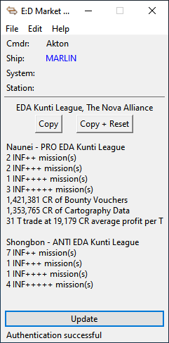

# Introduction

Elite: Dangerous Minor Faction Activity Tracker (EDMFAT) is an EDMC plug-in that automatically records in-game actions supporting or undermining a minor faction. For example, completing missions for a minor faction will increase that minor faction's influence. Completing missions for other minor factions in the same system will decrease that minor faction's influence. A busy session may give the following:

EDMFAT is aimed at **Elite: Dangerous** squadrons that support a minor faction for background simulation (BGS) work. Without the plug-in, players had to manually keep records. This is difficult for new players. It is also immersion-breaking and error prone, even for experienced ones. EDMFAT can also educate new players, recording activity that supports or undermines minor factions. 

EDMFAT was initially developed to support the [Elite Dangerous AU & NZ](https://inara.cz/squadron/687/) squadron and their minor faction [EDA Kunti League](https://inara.cz/galaxy-minorfaction/33400/), hence EDA Kunti League being the default minor faction.

Fly safe, commanders, from CMDR Akton!

# Installation and Upgrade

Requirements:
1. Install [Elite Dangerous Market Connector (EDMC)](https://github.com/EDCD/EDMarketConnector/wiki/Installation-&-Setup) version 4.0 or later.

To install or upgrade:
1. Download the latest MSI file under [Releases](https://github.com/anthonylangsworth/EDMFAT/releases) at the top right. You may get a warning saying it is potentially harmful. Please ignore these warnings.
2. Run the MSI. This installs the plug-in, upgrading if an earlier version is present. Running the MSI does not require local administrative privileges.
3. Restart EDMC if it was already running.

To remove or uninstall:
1. Stop EDMC if it is running.
2. Run "Add or Remove Programs" from the Windows Start menu.
3. Select "Elite: Dangerous Minor Faction Activity Tracker (EDMFAT)" then press "Uninstall".

# Use

1. Start EDMC. If you start EDMC while **Elite: Dangerous** is running, the plug-in may miss important events.
2. (Optional) Go to the "File" -> "Settings" menu, navigate to the "Minor Faction Activity Tracker" tab and select the minor faction(s) you want to support or undermine from the list. If they do not appear in the list, travel to a system where the faction is present then reopen the Settings dialog. EDMFAT saves the selected minor factions when EDMC shuts down and so only needs to be done once. EDMFAT does not save the list of minor factions.
3. Play **Elite: Dangerous**, supporting or undermining your minor faction(s). 
4. Minor faction-relevant activity will be captured and appear in the EDMC window. EDMFAT tracks completing [missions](doc/missions.md), selling bounty vouchers, selling combat bonds, trade (positive, negative and black market) and selling cartography data. EDMFAT does not track failed missions or clean ship kills, which may be added in the future. EDMFAT cannot track conflict zone wins and losses due to limitations with **Elite: Dangerous**. 
5. (Optional) Change the minor faction(s) to support or undermine as per step 2. This can be done at any time. Previous activity is retained.
6. When done, press the `Copy` button to copy your activity to the Windows clipboard.
6. (Optional) Instead of pressing the `Copy` button, press the `Copy + Reset` button to copy your activity to the Windows clipboard and clear any activity. This can be useful if you want to report activity part way through a session, such as before the daily tick.
7. Paste it into your squadron's Discord channel or wherever you report activity.

Read the [FAQ](doc/faq.md) for more details.

See [LICENSE](LICENSE) for the license.

# Limitations

1. Mission influence accuracy is limited by **Elite: Dangerous** as described under [missions](doc/missions.md).
2. EDMFAT cannot track conflict zone wins and losses because **Elite: Dangerous** does not report them.
3. EDMFAT is not state-aware to keep it simple. For example, the influence of a minor faction in a "War" state is fixed until the war completes. However, this plug-in will still track missions and other activity as normal.
4. EDMFAT does not store different minor factions for different commanders. This is intentional because many use multiple accounts for minor faction work to bypass daily caps.
5. EDMFAT is not localized. It is English only. Assistance is appreciated!
6. EDMFAT does not support console players. Sorry. This is a limitation of EDMC.

# Contributing and Development

Bugs reports and suggestions are welcome! Please read the [FAQ](doc/faq.md) for details.

See [Contributing](doc/contributing.md) if you want to help with development.

